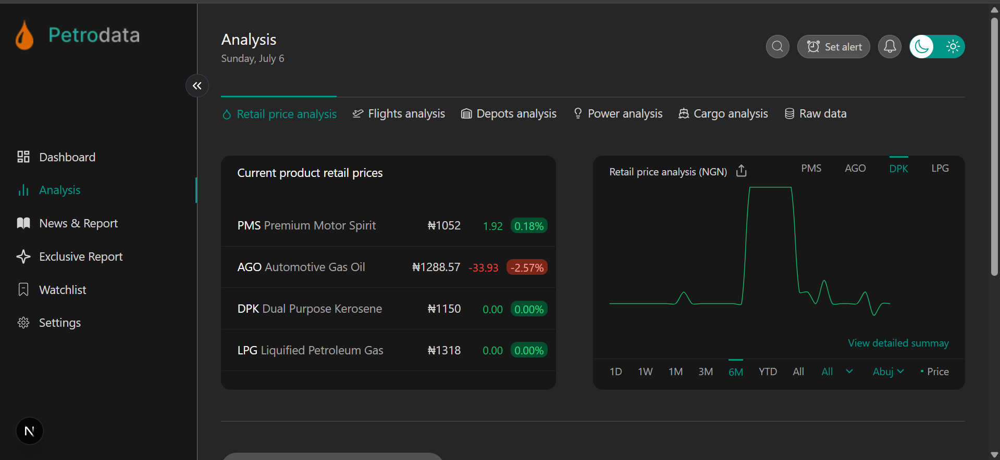

# PETROLEUM PRODUCTS PRICE ANALYSIS DASHBOARD

This dashboard provides a dynamic analysis of the retail prices of petroleum products across Nigeria’s 36 states between November 2024 and January 2025.

Built with Next.js, the dashboard displays weekly price trends, performance metrics, interactive filters, and downloadable reports for each product and state.

# Features
 Date Range: November 2024 – January 2025

 Product Analysis: PMS, AGO, DPK, LPG

 Geographic Filters: View by state or all states

 Interactive Charts: Line graphs powered by Chart.js

 Period Filters: 1 day, 1 week, 1 month, 3/6 months, 1 year

 Search & Filter: Real-time product search

 CSV Download: Download product trend as .csv

 Responsive Design: Optimized for desktops and tablets. 

# Technologies & Packages Used

FRAMEWORK:
Next.js

CHARTS & VISUALIZATION: 
Chart.js
react-chartjs-2

 STYLING:
Tailwind CSS

DATA HANDLING:
PapaParse
File Saver

ICONS:
React Icons

# Live Preview
https://petrodata-analysis.vercel.app

